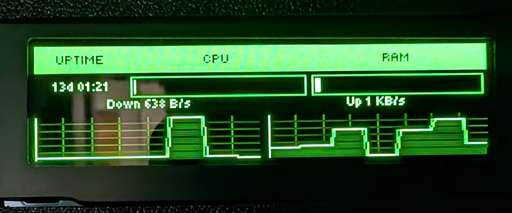

# FlowTile



Config-driven status display for small monochrome screens. 
Runs shell scripts, transforms their output with a small expression language, and 
draws the results as a grid of tiles on attached display.
Navigation via a 5-button GPIO joystick.

Both display and joystick can be configured (custom initializers if necessary)

Designed for Raspberry Pi on OpenWrt, but works anywhere you have a supported display and GPIO.

## Documentation

- [Overview & architecture](docs/overview.md)
- [Examples](docs/examples.md)
- [Config files](docs/config.md)
- [Components](docs/components.md)
- [Data pipeline](docs/data.md)
- [Flowline expression language](docs/flowline.md)
- [Navigation](docs/navigation.md)
- [General settings](docs/general.md)
- [Development](docs/development.md)

## Installation

**Requirements:** Python 3.14+

```bash
git clone https://github.com/your-username/flowtile
cd flowtile
```

Install dependencies — pick one:

```bash
# with uv (recommended)
uv sync

# with plain pip
python -m venv .venv
source .venv/bin/activate
pip install .
```

The app expects a `config/` directory as a sibling of the repo — not inside it:

```
parent/
  flowtile/    ← repo
  config/      ← your config (config.yaml + whatever you split it into)
  commands/    ← your shell scripts, but can be wherever
```

Create `config/config.yaml` to get started - see [examples.md](docs/examples.md) for complete working configs.

To run, with plain python:

```bash
python main.py
``` 

OR with UV

```bash
uv run python main.py
``` 